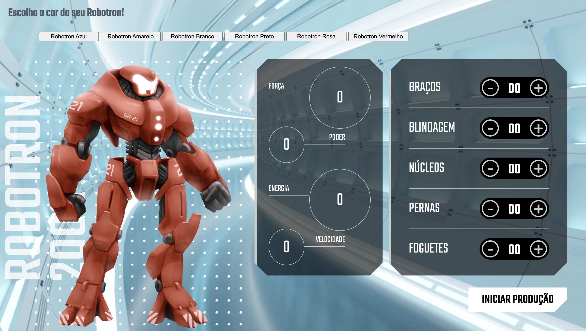

## 🖥️ Projeto
Esse é um projeto para defender a galáxia com a manipulação de robôs, utilizado para aprender mais sobre JavaScript. Também tive a oportunidade de conhecer mais um local para publicar nossos projetos, o site Vercel, muito fácil de utilizar e integrar com o GitHub.

## 🚀 Tecnologias
Esse projeto foi desenvolvido durante o curso da Alura com as seguintes tecnologias:

- HTML
- CSS
- JavaScript
- Git e Github
- Vercel

## 🏷️ Deploy 
Você pode visualizar o projeto através
[desse link](https://robotron-2000-theta-gules.vercel.app/)

## Agradecimento
Agradeço ao professor Pedro Marins pela excelente didática.

## Curso da Alura
[JavaScript: manipulando o DOM](https://cursos.alura.com.br/course/javascript-manipulando-dom)

